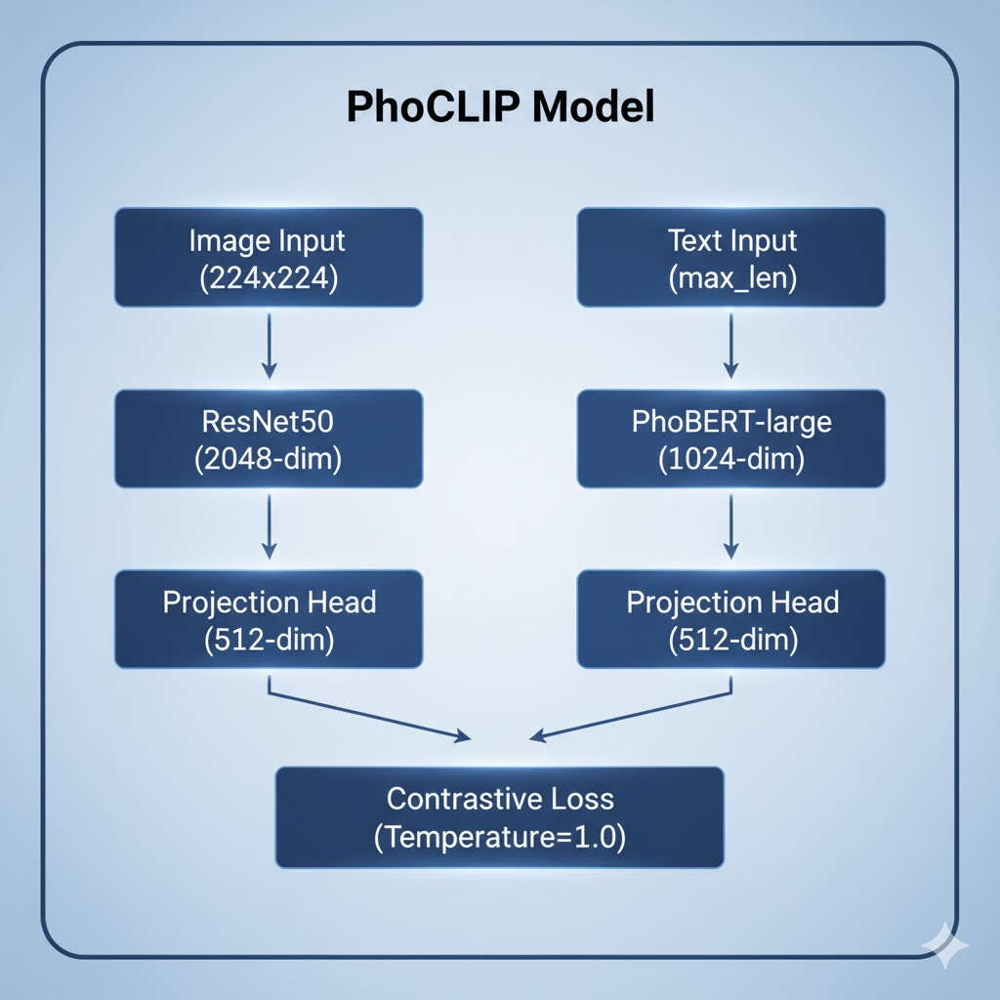

# PhoCLIP: Vietnamese Image-Text Matching


## Overview

PhoCLIP is a Vietnamese adaptation of CLIP (Contrastive Language-Image Pre-training), a multimodal learning framework that learns joint representations of images and text. This implementation addresses the lack of Vietnamese language support in existing vision-language models by combining state-of-the-art Vietnamese NLP models with proven computer vision architectures.

The model employs a dual-encoder architecture where images and Vietnamese text are independently encoded into a shared embedding space. Through contrastive learning, the model learns to maximize the similarity between matching image-text pairs while minimizing similarity for non-matching pairs. This approach enables bidirectional retrieval: finding relevant images given Vietnamese text queries, or generating Vietnamese descriptions for given images.

Our implementation leverages PhoBERT-large, a transformer-based model pre-trained on large-scale Vietnamese corpora, for text encoding. For image encoding, we utilize ResNet50 pre-trained on ImageNet. Both encoders are connected through projection heads that map their outputs to a common 512-dimensional embedding space where semantic similarity can be measured using cosine distance.


## Key Features

**Vietnamese Language Support**: Utilizes PhoBERT-large for robust Vietnamese text understanding, including proper handling of Vietnamese word segmentation and linguistic nuances.

**Multi-Dataset Training**: Trained on 168,725 images with 843,957 Vietnamese captions from COCO, Flickr30k, KTVIC, and OpenViIC datasets, ensuring broad coverage of visual concepts and linguistic expressions.

**Bidirectional Retrieval**: Supports both text-to-image search (finding images from Vietnamese descriptions) and image-to-text search (finding descriptions for given images).

**Efficient Architecture**: Employs ResNet50 for image encoding and PhoBERT-large for text encoding, with lightweight projection heads enabling fast inference on standard hardware.

**Contrastive Learning**: Uses symmetric cross-entropy loss with temperature scaling to learn discriminative representations in the shared embedding space.

## Installation

### Prerequisites

```bash
# Python 3.8 or higher
python --version

# CUDA-enabled GPU (recommended)
nvidia-smi
```

### Install Dependencies

```bash
pip install torch torchvision torchaudio
pip install timm transformers
pip install py_vncorenlp
pip install pandas numpy opencv-python albumentations
pip install matplotlib seaborn tqdm
pip install jsonlines
```

### Download VnCoreNLP

```python
import py_vncorenlp
py_vncorenlp.download_model()
```

## Usage

### Quick Start

```python
import torch
from phoclip import CLIPModel, find_matches
from transformers import AutoTokenizer

# Load model
model = CLIPModel()
model.load_state_dict(torch.load("best.pt"))
model.eval()

# Search images by text
find_matches(
    model,
    image_embeddings,
    image_filenames,
    text="xe hơi đậu trước ngôi nhà",
    n=25
)
```

### Training from Scratch

```python
from phoclip import main

# Configure training parameters in CFG class
# Then run training
main()
```

### Extract Embeddings

```python
from phoclip import get_image_embeddings, get_text_embeddings

# Get image embeddings
model, img_embeds = get_image_embeddings(valid_df, "best.pt")

# Get text embeddings
model, txt_embeds = get_text_embeddings(valid_df, "best.pt")
```

## Model Architecture

The PhoCLIP architecture consists of two parallel encoders that process images and Vietnamese text independently, followed by projection heads that map both modalities into a shared 512-dimensional embedding space. The model is trained using contrastive learning to align semantically related image-text pairs.


<div align="center">
  
  <p><em>Figure 1: PhoCLIP dual-encoder architecture with contrastive learning objective</em></p>
</div>

**Image Encoder**: ResNet50 pre-trained on ImageNet extracts visual features from 224×224 RGB images, producing 2048-dimensional representations that capture hierarchical visual patterns from low-level edges to high-level semantic concepts.

**Text Encoder**: PhoBERT-large processes Vietnamese text with proper word segmentation, generating 1024-dimensional contextual embeddings that encode both syntactic and semantic information specific to Vietnamese language structure.

**Projection Heads**: Lightweight fully-connected networks with GELU activation and layer normalization map both image and text representations to a common 512-dimensional space where cross-modal similarity can be computed efficiently.

**Training Objective**: The model optimizes a symmetric cross-entropy loss with temperature scaling (τ=1.0), encouraging high cosine similarity between matching image-text pairs while pushing apart non-matching pairs in the embedding space.

## Training

### Configuration

Key hyperparameters in `CFG` class:

```python
batch_size = 64
epochs = 1
image_encoder_lr = 1e-4
text_encoder_lr = 1e-5
head_lr = 1e-3
temperature = 1.0
projection_dim = 512
max_length = 70
```

### Datasets

The model is trained on multiple Vietnamese image-caption datasets:

| Dataset | Images | Captions | Language |
|---------|--------|----------|----------|
| COCO (translated) | 123,287 | 616,767 | Vietnamese |
| Flickr30k | 31,783 | 158,915 | Vietnamese |
| KTVIC | 4,327 | 21,635 | Vietnamese |
| OpenViIC | 9,328 | 46,640 | Vietnamese |

### Training Pipeline

1. **Data Preprocessing**
   - Image resizing to 224x224
   - Vietnamese text segmentation with VnCoreNLP
   - Normalization

2. **Model Training**
   - Contrastive learning with symmetric cross-entropy loss
   - AdamW optimizer with learning rate scheduling
   - Early stopping based on validation loss

3. **Evaluation**
   - Top-K accuracy (K=1, 5, 10)
   - Image-to-text and text-to-image retrieval

## Experimental Results

### Qualitative Results

The following examples demonstrate the model's capability to retrieve semantically relevant images from Vietnamese text queries:

#### Query: "xe hơi đậu trước ngôi nhà"


#### Query: "hai con chó"


#### Query: "một người đang dùng máy tính"


#### Query: "đi siêu thị"


### How It Works

1. **Input**: Vietnamese text query (e.g., "xe hơi đậu trước ngôi nhà")
2. **Text Encoding**: PhoBERT converts text to 1024-dim vector
3. **Projection**: Maps to 512-dim shared space
4. **Similarity Search**: Computes cosine similarity with all image embeddings
5. **Output**: Top-K most similar images

### Analysis

The qualitative results demonstrate several key capabilities of the model. First, it exhibits robust understanding of Vietnamese linguistic structures, correctly interpreting compound words and phrases that are characteristic of the Vietnamese language. Second, the model shows strong object recognition abilities, accurately identifying entities such as vehicles, animals, and electronic devices across diverse visual contexts. Third, it demonstrates scene-level understanding, successfully retrieving images that match not just individual objects but entire scenarios described in the queries. Finally, the model captures action and activity semantics, distinguishing between static objects and dynamic scenes involving human activities.

These results suggest that the contrastive learning approach effectively bridges the semantic gap between Vietnamese text and visual content, enabling meaningful cross-modal retrieval despite the linguistic differences between Vietnamese and the languages typically used in vision-language pre-training.

## Advanced Usage

### Custom Dataset

```python
import pandas as pd

# Prepare your data
df = pd.DataFrame({
    'image': ['img1.jpg', 'img2.jpg'],
    'caption': ['mô tả 1', 'mô tả 2']
})

# Build dataloader
train_loader = build_loaders(df, tokenizer, mode="train")
```

### Fine-tuning

```python
# Freeze image encoder
CFG.image_encoder_trainable = False

# Train only text encoder and projection heads
model = CLIPModel()
# ... training code
```

## Project Structure

```
Phoclip/
├── phoclip.py          # Main implementation
├── phoclip.ipynb       # Jupyter notebook
├── README.md           # This file
├── best.pt             # Trained model weights (after training)
└── images/             # Image dataset directory
```

## Contributing

Contributions are welcome! Please feel free to submit a Pull Request.

## License

This project is licensed under the MIT License - see the LICENSE file for details.

## Acknowledgments

- **PhoBERT**: [VinAI Research](https://github.com/VinAIResearch/PhoBERT)
- **CLIP**: [OpenAI](https://github.com/openai/CLIP)
- **VnCoreNLP**: [Vietnamese NLP Toolkit](https://github.com/vncorenlp/VnCoreNLP)
- **Original PhoCLIP**: [ducngg/PhoCLIP](https://github.com/ducngg/PhoCLIP)
- **Datasets**: COCO, Flickr30k, KTVIC, OpenViIC

## Contact

For questions or feedback, please open an issue on GitHub.

## Citation

If you use this work in your research, please cite:

```bibtex
@misc{phoclip2024,
  title={PhoCLIP: Vietnamese Image-Text Matching using Contrastive Learning},
  author={Trinh, Hao},
  year={2024},
  publisher={GitHub},
  url={https://github.com/Trinhvhao/PhoCLIP-Vietnamese-Finetune}
}
```

---

This project is developed for research and educational purposes in Vietnamese natural language processing and multimodal learning.
